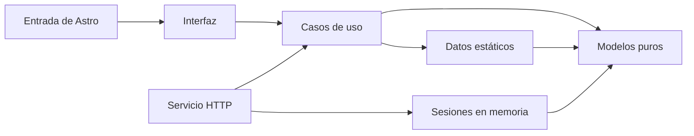

# Arquitectura

Astro convierte el contenido en HTML durante la compilación. El navegador recibe páginas estáticas, estilos y módulos localizados de TypeScript compilado para exposición, animaciones y actividades. Los componentes interactivos usan módulos localizados, sin hidratar la página completa. Para conectar teléfonos por QR se añade un servicio HTTP pequeño, independiente de la compilación editorial.

| Carpeta | Responsabilidad |
| --- | --- |
| `src/domain/` | Modelos puros: secciones, especies, amenazas, escenarios y citas |
| `src/application/` | Obtener contenido y referencias; evaluar respuestas sin efectos secundarios |
| `src/infrastructure/` | Contenido científico y escenarios tipados; catálogo de fuentes públicas |
| `src/ui/` | Página, componentes Astro, gráficos, estilos y comportamiento del navegador |
| `src/shared/` | Constantes comunes y tipos auxiliares |
| `src/pages/` | Entradas de Astro para `/`, `/exposicion/` y `/participar/` |
| `tests/` | Comprobación de lógica, contenido, contraste y navegador |
| `scripts/` | Comprobaciones pequeñas de código, plantillas y HTML generado |
| `server/` | Adaptador HTTP nativo de Node.js: archivos estáticos y sesiones efímeras |

Las flechas indican dependencias. El dominio no conoce Astro, el navegador ni los datos concretos. La interfaz obtiene los datos a través de los casos de uso. La evaluación recibe un escenario y respuestas y devuelve explicaciones: es fácil probarla sin abrir la página.

El acceso al contenido estático es directo desde la aplicación. No hace falta un contenedor de dependencias ni una API para los textos científicos. La actividad conectada usa una interfaz mínima `LiveStore` porque necesita coordinar una misma sesión entre dispositivos; su única implementación es memoria temporal.

## Interactividad localizada

`Activity.astro` crea el HTML accesible. `activity.ts` añade selección de escenarios, validación, explicaciones y reinicio; llama a `evaluateActivity`. Sin JavaScript quedan disponibles las explicaciones en elementos `details`.

`exposure.ts` mide el encabezado para que la barra de progreso no lo cubra, amplía el modo de lectura y lleva el foco al título al navegar. No guarda preferencias ni respuestas. No hay solicitudes de red desde esos módulos.

También gestiona pantalla completa con la API nativa: escucha los cambios del navegador para mantener el botón sincronizado, permite salir y anuncia un rechazo sin interrumpir la exposición.

En pantalla completa, `exposure.ts` marca la sección activa y habilita navegación desde un control inferior o el teclado. CSS oculta encabezado, barra superior y secciones inactivas. El seguimiento del scroll se suspende en esa vista para no confundir secciones ocultas con la sección actual. Al salir se restablece la landing y el foco vuelve al control de pantalla completa.

`ecosystem-motion.ts` coordina los botones de pausa de las ilustraciones. Usa `IntersectionObserver` para pausar fuera de pantalla, el estado de visibilidad de la pestaña y la preferencia de movimiento reducido. Las animaciones están en CSS y solo modifican transformaciones y opacidad de elementos gráficos; no animan texto ni producen cambios de contenido. La vista de exportación no activa estas animaciones.

## Exportar la exposición

`prepare-presentation.ts` prepara un modelo común de 16 diapositivas a partir de los bloques existentes: contenido, actividad, explicaciones y bibliografía. La página `/exposicion/` lo representa con los componentes gráficos originales y una hoja de impresión 16:9. «Guardar PDF» abre la impresión nativa del navegador; no requiere servidor de conversión.

El adaptador `src/infrastructure/export/pptx.ts` escribe un resumen editable en PresentationML (Open XML). El empaquetador ZIP usa únicamente TypeScript y archivos conocidos del proyecto. Incluye tema, master, layout, diapositivas y relaciones de enlaces; no incluye imágenes o datos de los visitantes. `scripts/generate-presentation.ts` lo genera antes del desarrollo y de la compilación. Esta ruta evita añadir una librería de exportación al navegador. Las pruebas verifican el empaquetado, las referencias y los textos editables; la compatibilidad visual con cada editor requiere abrir el archivo en ese editor.

Los colores, fuentes y espacios están en `tokens.css`; `global.css` define la composición y sus adaptaciones. Las ilustraciones usan SVG y CSS originales. El contorno de Colombia deriva de coordenadas públicas de Natural Earth; su procedencia está registrada en `docs/assets.md`.

## Herramientas de validación

El lint del proyecto comprueba reglas explícitas y el analizador de TypeScript. `typecheck` usa `tsc` y convierte las plantillas Astro a archivos TSX virtuales, con el compilador oficial, para comprobar sus props y expresiones. No escribe archivos generados dentro de `src/`. Esta comprobación es específica del proyecto, no una auditoría completa de accesibilidad.

Las pruebas usan el ejecutor de Node.js 24. Playwright es una dependencia de desarrollo para verificar el resultado construido; nunca llega al contenedor final.

## Sesiones por QR

`LiveActivity` contiene las reglas: tres minutos como límite total, fases, validación, puntuación y acumulación de estadísticas. Recibe un reloj y un generador de valores aleatorios; así se prueba toda la sesión sin esperar tres minutos reales. `MemoryLiveStore` conserva contadores y el indicador de envío por acceso temporal, nunca listas de respuestas individuales.

`live-http.ts` adapta esas reglas al HTTP nativo de Node.js y sirve la web construida. `live.ts` configura el reloj monotónico, la aleatoriedad criptográfica y la limpieza periódica. No hay base de datos, servicios de terceros, logs de solicitudes ni escritura de sesiones a archivos.

El anfitrión y los teléfonos consultan la misma API una vez por segundo. Un envío confirmado es idempotente: reintentar no añade un segundo voto. El teléfono verifica su confirmación y calcula su puntaje al recibir las soluciones al cierre. Los accesos aleatorios permanecen en variables de memoria; no se añaden cuentas, cookies o almacenamiento del navegador.

`qrcode` genera el QR localmente. Es la única biblioteca añadida para esta función; no se utiliza una API externa de imágenes. Node.js ejecuta el TypeScript del servicio de forma nativa. La comprobación de tipos abarca también `server/`, los scripts y las pruebas.

## Ejecución en producción

`deploy/` contiene configuración operativa, separada del contenido y la interfaz. Nginx termina HTTPS y envía web y API al contenedor en `127.0.0.1:8082`; systemd administra su arranque. El servicio exige `PUBLIC_ORIGIN` para las mutaciones y conserva las sesiones únicamente en su proceso. Una sola instancia evita repartir participantes entre memorias diferentes. `scripts/check-deployment.ts` comprueba recursos, cabeceras, redirección y salud por HTTPS después de publicar, sin crear actividades.

## Autoría opcional de exportación

La portada general proviene del modelo de presentación. `PrivateCover` valida el código en el servidor mediante scrypt y devuelve la autoría definida en un secreto montado; esos datos no pertenecen al contenido estático. El navegador los añade con `textContent` únicamente durante la impresión y los elimina después. La configuración privada es opcional y no cambia las reglas de la actividad por QR.

## Cronómetro de exposición

`ExposureClock` conserva tiempo acumulado y un reloj monotónico. `exposureTiming` calcula bloque, tiempo restante y aviso a 15 segundos sin conocer el navegador. Las dos rutas viven en `src/infrastructure/exposure-plans.ts`. La interfaz actualiza una lectura compacta y anuncia únicamente cambios relevantes; no guarda estado, no envía solicitudes y no modifica la sección activa. La impresión usa una cuadrícula de encabezado, contenido y pie para conservar las áreas de cada diapositiva.
